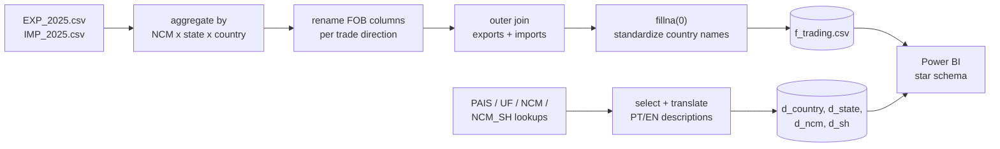
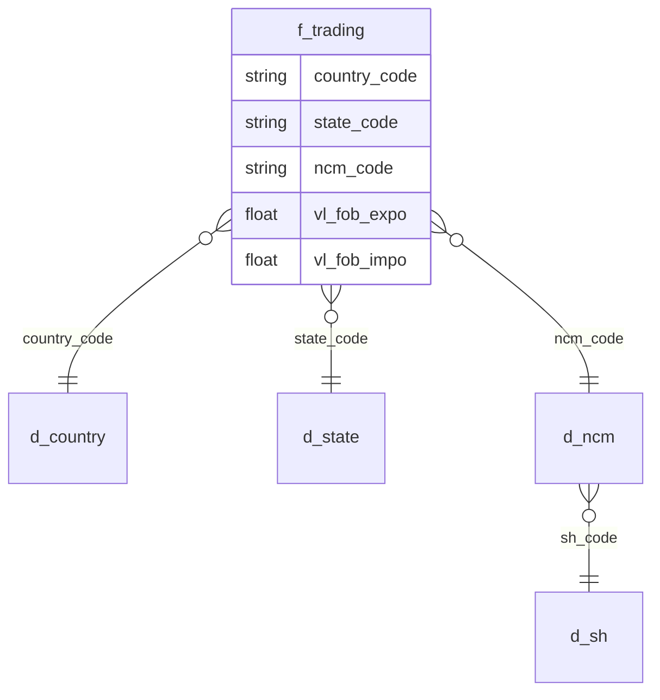

<p align="center">
  
</p>

<p align="center">
  
  
  
  
</p>

# Brazil Trading with the World, 2025

A star-schema dashboard on Brazil's 2025 export/import data (Jan-Apr, Comex Stat), built from raw government CSVs through a Python cleaning pipeline into a Power BI model. Answers 5 trade questions (balance, top partners, top products, state performance, market share) in under 30 seconds and 1-2 clicks.

<p align="center">
  
</p>

## Pipeline

Comex Stat ships raw export/import transactions and 4 separate dimension lookups, in Latin-1, semicolon-delimited, no shared key naming. `scripts/data_cleaning.py` turns that into a single analysis-ready star schema:



- Aggregates raw transactions to (NCM code x state x country) before joining, so the fact table doesn't carry line-item noise into the model
- Outer-joins exports and imports on the same grain instead of stacking them, so trade balance is a single subtraction, not a cross-table calculation
- Fixes a real data quality issue at the source ("Países Baixos (Holanda)" vs "Holanda" inconsistency) rather than patching it downstream in DAX
- Re-encodes to UTF-8-sig with full quoting, the raw government exports aren't safe to load as-is
- Output: one 17MB fact table + 4 dimension tables, `data/final tables/`

## Data model



Grain is SH2 (2-digit Harmonized System), not the full 8-digit NCM. NCM has ~13,000 codes, unreadable in any chart; SH2 collapses to ~99 product groups while keeping the drill path to NCM available underneath for anyone who needs it.

## Design decisions

| Decision | Choice | Why |
|---|---|---|
| Layout | Single page over multi-page | Every question answerable without a page switch; kept it to a 16:9 executive-presentation frame |
| Product grain | SH2 over 8-digit NCM | ~99 readable categories vs ~13,000 unchartable codes |
| Labels | Claude MCP-assisted rename | 99 category labels, PT + EN, by hand would've been the slowest part of the build |
| Theme | Dark neutral over flag-colored | Flag colors as a palette fight the data itself for attention |

## Repo structure

```
brazil-trading-with-the-world-2025/
├── brazil-trading.pbix
├── data/final tables/        6 CSVs: 1 fact, 4 dimensions
├── design/                   Figma-exported theme + background
├── scripts/
│   └── data_cleaning.py      raw Comex Stat -> star schema
└── assets/                   header, demo GIFs, data model GIF
```

## Run it yourself

```bash
git clone https://github.com/devletstahl/brazil-trading-with-the-world-2025.git
cd brazil-trading-with-the-world-2025
python scripts/data_cleaning.py   # rebuilds data/final tables/*.csv from raw Comex Stat exports
```

Then open `brazil-trading.pbix` in Power BI Desktop and point it at `data/final tables/`.

## Results

- Time to insight: ~20s (target was 30s)
- Interactions to answer: 1-2 clicks
- Load time: under 3s
- Known limits: Jan-Apr 2025 only (partial year), FOB values only (freight/insurance excluded), map visual license blocks web publishing

## License

[MIT](LICENSE)
