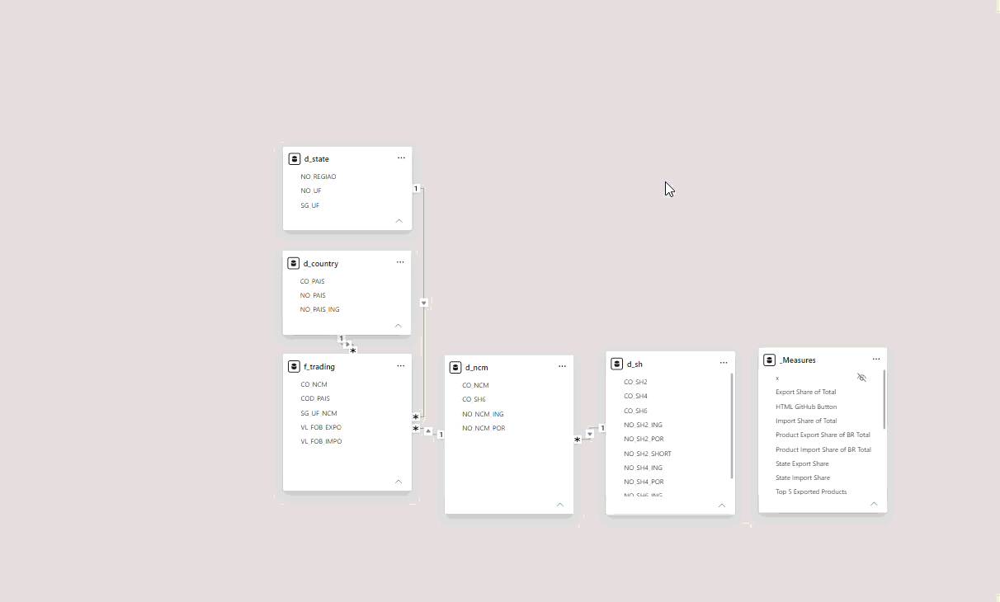

<div align="center">
  
</div>
<br/>
<div align="center">
  
  &nbsp;
  
  &nbsp;
  
</div>

---

## ✦ Business Context

Brazil is one of the world's top commodity exporters, yet professionals who work with trade data (analysts, consultants, procurement managers) often rely on fragmented government platforms that require significant technical familiarity to extract insights.

**The problem:** existing dashboards from sources like Comex Stat and Apex Brasil are functional but not designed for fast, executive-level decision-making. A manager who needs to answer "which are our top 5 export markets this year, and how does São Paulo's share compare to the South region?" must navigate multiple screens, apply filters manually, and mentally connect the pieces.

**The question this project answers:** Can a single-page interactive dashboard give a trade analyst or business manager a complete picture of Brazil's 2025 trade flows (by product, state, and partner country) in under 30 seconds of interaction?

### Key Business Questions

| # | Question | Visual |
|---|----------|--------|
| 1 | What is Brazil's overall trade balance in 2025? | KPI cards |
| 2 | Which are the top 5 export and import partner countries? | Bar charts |
| 3 | How are trade flows distributed across Brazilian states and regions? | Interactive map |
| 4 | Which product categories dominate exports and imports? | Bar charts (SH2) |
| 5 | For a given country or state, what is the product mix and market share? | Custom tooltips |

### Stakeholders & Use Cases

| Stakeholder | Primary need |
|---|---|
| Export/import analyst | Quick overview of trade flows without manual data extraction |
| Business development manager | Identify top partner countries to prioritize |
| Comex consultant | Benchmark state performance and product category trends |
| Student / researcher | Accessible, documented dataset for academic analysis |

---

## ✦ Solution Design

Before writing a single line of code or opening Power BI, I defined the scope: one page, five core questions, executive-friendly layout. <br>
That constraint shaped every decision that followed, including data model, visual types, color palette, and tooltip depth.

The design process followed three stages:

1. **Define scope** — establish the business questions and the minimum viable answer for each
2. **Model the data** — build a star schema that supports filtering by country, state, and product without performance issues
3. **Design the experience** — mockup in Figma first, then build in Power BI to match

This order matters. Starting with visuals before defining the questions leads to dashboards that look good but don't answer anything specific.

---

## ✦ Features

- Overview of exports and imports by FOB value (USD)
- Top 5 export and import markets
- Interactive map by state and region
- Top 5 exported and imported products
- Dark theme with a cohesive color palette and clean typography

<div align="left">
  
</div>

---

## ✦ Getting the Data

The Brazilian government offers a very user-friendly platform with detailed import and export data: [Comex Stat](http://comexstat.mdic.gov.br/).

The datasets used in this project:

| File | Description |
|------|-------------|
| `EXP_2025.csv` | Export transactions in 2025 |
| `IMP_2025.csv` | Import transactions in 2025 |
| `PAIS.csv` | Country dimension table |
| `UF.csv` | Brazilian states dimension table |
| `NCM.csv` | Product classification (NCM) |
| `NCM_SH.csv` | SH product hierarchy |

---

## ✦ Transforming the Data

Data cleaning and preparation were done in Python with pandas. Here's what was applied:

**Fact table — `f_trading.csv`**
- Exports and imports were aggregated by `CO_NCM`, `SG_UF_NCM` and `CO_PAIS`
- FOB values were summed per group
- Both datasets were merged with an outer join, filling missing values with `0`

**Dimension tables**

| Output file | Columns kept | Notes |
|-------------|-------------|-------|
| `d_country.csv` | `CO_PAIS`, `NO_PAIS`, `NO_PAIS_ING` | "Países Baixos (Holanda)" renamed to "Holanda" / "Netherlands" |
| `d_state.csv` | `SG_UF`, `NO_UF`, `NO_REGIAO` | — |
| `d_ncm.csv` | `CO_NCM`, `CO_SH6`, `NO_NCM_POR`, `NO_NCM_ING` | Exported with full quoting |
| `d_sh.csv` | `CO_SH6`, `NO_SH6_POR`, `NO_SH6_ING`, `CO_SH4`, `NO_SH4_POR`, `NO_SH4_ING`, `CO_SH2`, `NO_SH2_POR`, `NO_SH2_ING` | — |

<div align="left">
  
</div>

---

## ✦ Deciding the Theme

Before building anything, I explored color patterns using [Power BI Studio](https://www.powerbistudio.com/), a theme generator that makes it easy to experiment with palettes and export a `.json` file directly to Power BI. I considered blue, green, and yellow, classic Brazilian palette vibes, but ended up going for a dark, neutral palette instead. No need to force Brazilian colors when the data already tells the story.

You can find the theme file at `design/Custom Theme.json` and apply it under **View > Themes > Browse for themes**.

---

## ✦ Creating the Mockup in Figma

Figma was used only to build the background and plan the layout, deciding where each visual would live, following the reference infographic as a starting point. From there, I adapted the layout to fit the theme and the available data.

The original background file is available at `design/background.png`.

---

## ✦ Building the Visuals in Power BI

Visuals were designed following the reference infographic, using built-in Power BI visuals styled with the custom theme.

**Map visual used:**
> **Maps** by Alexander Koch — v1.0.6.7
> [AppSource](https://appsource.microsoft.com) · Support: [relevantvisuals.com](https://www.relevantvisuals.com)

I used a Projection Map for Brazil, with states colored by region: North, Northeast, Midwest, Southeast, South, and Federal District.

---

## ✦ Optimizing Labels with Claude MCP

The SH2 product names were too long to display cleanly in bar and column charts. To fix this, I used the **Claude Modeling MCP** to generate short English versions of each SH2 category, making the visuals easier to read without losing meaning.

---

## ✦ Adding Context with Tooltips

I added 5 custom tooltips to give more context when hovering over countries and states, showing:

- Main products traded
- Market share
- Trade balance

<div align="left">
  
</div>

---

## ✦ Decisions & Trade-offs

Every project involves constraints. Here's what I chose and why:

| Decision | Chosen | Discarded | Reason |
|---|---|---|---|
| Page layout | Single-page | Multi-page | Executive use case requires speed; one glance, full picture |
| Product granularity | SH2 (broad category) | NCM (8-digit) | SH2 readable in bar charts; NCM produces 9,000+ items |
| Map type | Projection map (3rd party) | Built-in filled map | Built-in doesn't support state-level Brazil well |
| Color palette | Dark neutral | Brazilian flag colors | Data-first: colors shouldn't carry meaning unless intentional |
| Label optimization | AI-assisted (Claude MCP) | Manual editing | 99 SH2 categories × 2 languages = impractical to do manually |

**Known limitations:**
- Data reflects Jan–Apr 2025 (partial year); full-year comparisons are not yet possible
- The `.pbix` file cannot be published online due to the map visual license
- FOB values exclude freight and insurance costs, which affects import comparison accuracy

---

## ✦ Repository Structure

```
brazil-trading-with-the-world-2025/
│
├── assets/                  # Images and GIFs used in this README
├── data/
│   ├── raw/                 # Original files from Comex Stat
│   └── processed/           # Cleaned output files (f_trading, d_country, etc.)
├── design/
│   ├── background.png       # Figma background used in the dashboard
│   └── Custom Theme.json    # Power BI theme file
├── data_cleaning.py         # Python script for data preparation
├── brazil-trading.pbix      # Power BI file
└── README.md
```

---

## ✦ How to Use

Due to the map visual license, this dashboard is not available for web viewing. You can download the `.pbix` file and explore it locally in Power BI Desktop.

1. Clone or download this repository
2. Open `brazil-trading.pbix` in Power BI Desktop
3. Explore the dashboard: hover over countries and states to see the tooltips in action
4. Make it yours: swap the data for another country, adjust the color theme, or extend the visuals however you like

---

## ✦ License

This project is licensed under the [MIT License](LICENSE). Feel free to use it, adapt it, and make it your own.

If you build something inspired by this project, I'd love to see it. Credit is appreciated but not required.

---

<sub>☕︎ Made by <a href="https://github.com/devleticiastahl">Leticia Stahl</a></sub><br><br>
[](https://github.com/emilyaugusto)
